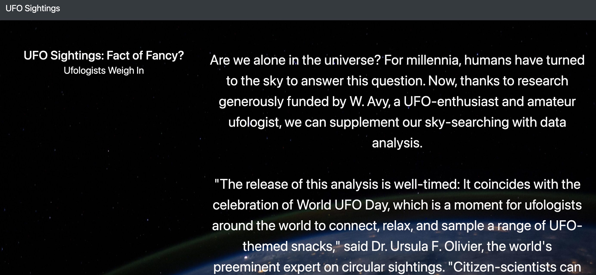
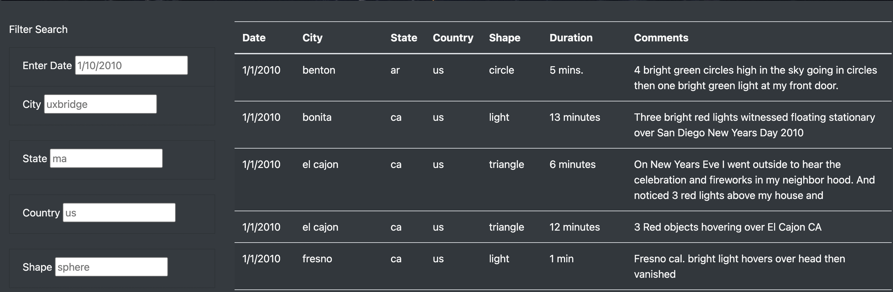
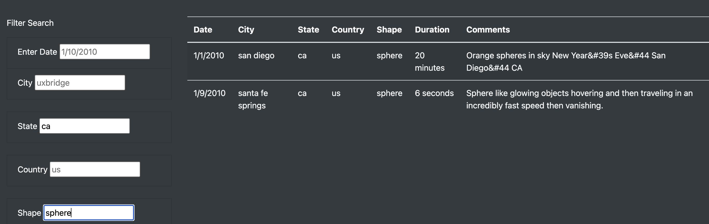

# UFOs
## Overview
The purpose of this analysis is to provide users with multiple filters in researching UFO sightings across an extended time period, multiple locations, and distinct UFO characteristics and descriptions. The data,js file containing all of this information can be filtered with our new website giving curious users the ability to pinpoint sightings occuring on their birthday, locations close to where they live, or even what shape the UFO was when it was sighted. 

## Results

- In the first image we see the top of the webpage that the user will see once opening the html document. 

- After scrolling down the new filters have been included into the final webpage. The default entries are from a random UFO sighting included in the data.js file. 

- After interacting with two of the five filters (selecting "ca" as the state and "sphere" as the shape), we now have two sightings listed with these features. Our filters are working perfectly! 

## Summary
One drawback from the website's design is the cluttering of all the data listed before filtering. Once way to improve the design would be having the data hidden until filtered would provide a cleaner and less clustered page. If a user wanted to see all sightings we could add a "View All" button. A second feature that could be added to better the quality of our website would be included local news reports from these sightings. Once filtering is complete a link is provided to view extra information and/or reactions to the individual cases.  
